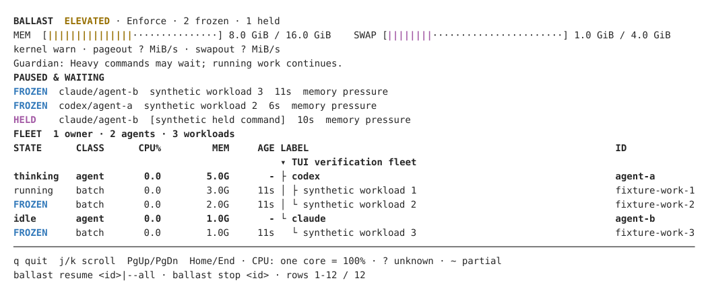
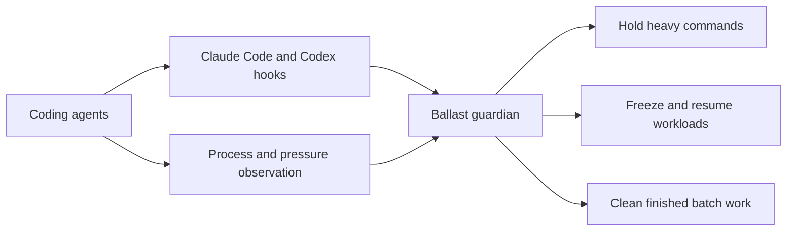

# Ballast

Keep your laptop responsive while coding agents work in parallel.

Ballast watches agent processes and memory pressure, holds heavy commands when headroom is low, and pauses workloads before your machine starts thrashing.
Install once, then keep using your agents as usual.

<picture>
  <source media="(prefers-color-scheme: dark)" srcset="docs/images/top-dark.svg">
  <source media="(prefers-color-scheme: light)" srcset="docs/images/top-light.svg">
  
</picture>

*A real `ballast top` capture of the synthetic demo fleet, with simulated memory pressure.*

## Install

Alpha software for macOS 11+ (Apple Silicon and Intel) and Linux (amd64 and arm64).
Package installation becomes available with the first published release.

**macOS**

```sh
brew install anur4ag/tap/ballast
ballast install
```

**Debian 12 / Ubuntu 22.04 or newer**

```sh
sudo install -d -m 755 /etc/apt/keyrings
curl -fsSL https://anur4ag.github.io/ballast/key.gpg | sudo tee /etc/apt/keyrings/ballast.asc >/dev/null
sudo chmod 644 /etc/apt/keyrings/ballast.asc
echo "deb [signed-by=/etc/apt/keyrings/ballast.asc] https://anur4ag.github.io/ballast/apt stable main" | sudo tee /etc/apt/sources.list.d/ballast.list
sudo apt update && sudo apt install ballast
ballast install
```

`ballast install` starts a per-user service and adds agent hooks.
Open Codex, run `/hooks`, and approve the Ballast hooks when prompted.
Start a new agent session after installation.
Use `ballast doctor` to check the service, hooks, trust and platform access.
Homebrew and APT upgrades restart the daemon automatically; no second install command is needed.

Prefer asking your coding agent?
Paste: **“Follow https://github.com/anur4ag/ballast/blob/main/docs/install-with-an-agent.md to install Ballast for me; show me the exact plan before applying it.”**

[Manual installation and platform requirements](docs/platforms.md) · [Install with an agent](docs/install-with-an-agent.md)

## What happens automatically

| When | Ballast's response |
| --- | --- |
| Your machine has headroom | Work runs without delay. |
| Memory pressure rises | Claude Code and Codex hooks hold new heavy commands until there is headroom. |
| Pressure becomes critical | The guardian freezes eligible agent workloads, then resumes them after pressure clears. It never kills work to relieve pressure. |
| An agent tries to kill another agent's work | Hooks reject supported destructive commands with an explanation. |
| A port is already owned by another agent | Hooks explain the conflict. |
| An agent exits | Leftover batch work is cleaned up after a grace period. Dev servers are reported and kept. |
| Ballast is unavailable | Hooks fail open so agent tools keep working. |



Ballast attributes work by process ancestry and agent markers.
Unattributed processes and agent roots remain protected.
It works locally as your user, with no root daemon and no changes to the commands you give agents.

## See and control your fleet

| Command | Purpose |
| --- | --- |
| `ballast top` | Live fleet, pressure, waiting commands and paused work. |
| `ballast ps` | Agent and workload IDs; add `--json` for scripts. |
| `ballast status` | Daemon health and pressure. |
| `ballast report --since 7d` | Local history of holds, freezes and cleanup. |
| `ballast resume --all` | Resume paused work, including after a daemon failure. |
| `ballast stop <id>` | Stop a selected workload or an agent's workloads. |
| `ballast gc` | Clean finished batch work and list surviving services. |

[CLI controls and JSON reference](docs/cli.md)

## Privacy

Ballast has no telemetry, accounts or cloud service.
Process observation, decisions and reports stay on your machine in `~/.ballast`.
Local state can include command labels and working directories; treat logs as private when sharing diagnostics.

## Uninstall

Remove the per-user service and hooks before removing the package:

```sh
ballast uninstall
brew uninstall ballast        # macOS
# sudo apt remove ballast     # Debian / Ubuntu
```

Use `ballast uninstall --purge` to also delete Ballast configuration, state and logs.
If you removed the package first, hooks silently skip the missing binary; reinstall the package and run `ballast uninstall` to remove the remaining service and hooks.

## Known limitations

- Alpha software: review behavior on your workloads before relying on it for long unattended runs.
- macOS and Linux only; Linux installation needs a working systemd user session.
- Admission hooks cover Claude Code and Codex. Other recognized agents get process observation without admission hooks.
- Process attribution can be incomplete; uncertain ownership is left alone.
- Hooks cannot catch every shell construct. Ballast is not a sandbox, scheduler or security boundary.
- No support for managing workloads inside containers or VMs from the host, or across machines.
- Notifications require a desktop session; headless users can inspect `ballast top` and logs.

[Architecture](docs/architecture.md) · [Contributing](docs/contributing.md) · [Release process](docs/releases.md) · [Security](SECURITY.md)

Licensed under [MIT](LICENSE-MIT) or [Apache-2.0](LICENSE-APACHE), at your option.
